### Welcome to Automating Documentation, Presentation, Knowledge base using Markdown (Zero to Hero)

#### **null puliya** by ***Madhu Akula***

11th Feb 2017


## About Me !
- Automation Ninja at [Appsecco](http://appsecco.com)
- Fusion of Security, DevOps and Cloud
- Speaker & Trainer at Defcon, All Day DevOps, DevSecCon, etc
- Found bugs in Google, Microsoft, Yahoo, etc
- Never ending learner
- Follow (or) Tweet to me [@madhuakula](https://twitter.com/madhuakula)


## What you are going learn?
- Basics of Markdown and how to version control
- Automating Documentation, Presentation, Knowledgebase using Markdown
- Lot of exercises & tools
- Tips & Tricks to use in automated work flow


## Pre-requisites
- Anyone interested in automating their work flows using `Markdown`
- If you want practice along, Laptop with admin privilege required
- VirtualBox 5 (or) above
- Minimum 2GB RAM & 10GB Disk space


## Import virtual machine appliance
- Please import the virtual machine appliance from `null-puliya-adpk/automated-markdown.ova`

*images need to insert here*


## Start the virtual machine & Login

```
Username: ubercool
Password: forgot
```


## Local documentation for reference
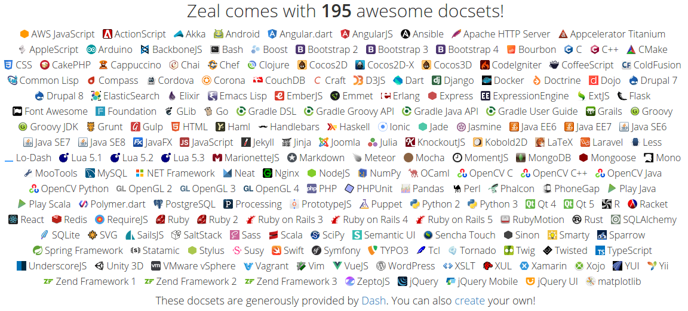


## Zeal Application
- [Zeal](https://zealdocs.org/) is an off-line documentation browser. Very useful!
- MAC Alternative is [Dash](https://kapeli.com/dash)
- To open Zeal application, click on `Applications` and type `Zeal`


## What is Markdown?
> Markdown is a lightweight markup language with plain text formatting syntax designed so that it can be converted to HTML and many other formats. 
> - https://en.wikipedia.org/wiki/Markdown

[Read more about here](https://daringfireball.net/projects/markdown/)


## Powers of Markdown
- Plain Text
- Easy to read and write
- We can version control everything
- Generate awesome things (PDF, HTML, etc)


## Markdown Cheat Sheet
- Get here [http://packetlife.net/media/library/16/Markdown.pdf](http://packetlife.net/media/library/16/Markdown.pdf)
- Open offline copy at `Documents/markdown-cheat-sheet.pdf`
- To know more about syntax [https://daringfireball.net/projects/markdown/syntax](https://daringfireball.net/projects/markdown/syntax)


## Open Markdown Editor (ReText) and Follow below
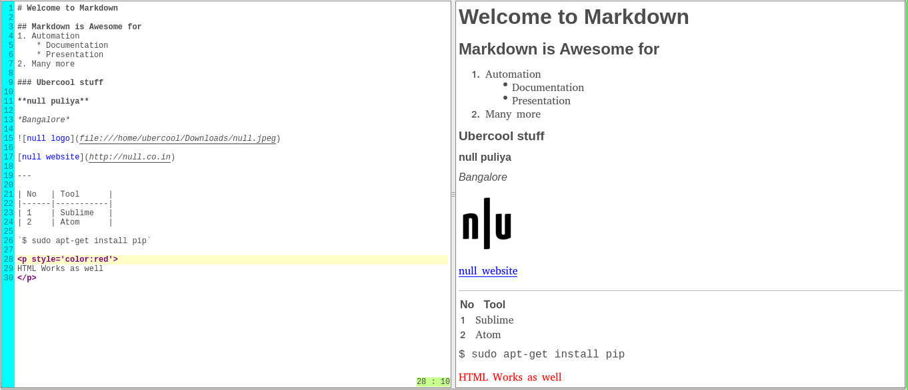


## Exercise-1
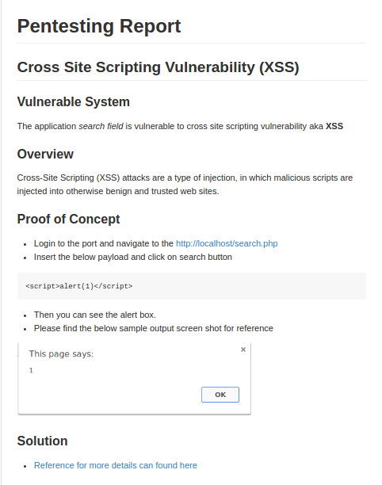

- Hint: Image can found here `home/ubercool/Downloads/xss.png`


## Exercise-1 Solution
````
# Pentesting Report

## Cross Site Scripting Vulnerability (XSS)

### Vulnerable System

The application *search field* is vulnerable to cross site scripting vulnerability aka **XSS**

### Overview
Cross-Site Scripting (XSS) attacks are a type of injection, in which malicious scripts are injected into otherwise benign and trusted web sites.

### Proof of Concept
- Login to the port and navigate to the [http://localhost/search.php](http://localhost/search.php)
- Insert the below payload and click on search button

```
<script>alert(1)</script>
```

- Then you can see the alert box.
- Please find the below sample output screen shot for reference


### Solution

- [Reference for more details can found here](https://www.owasp.org/index.php/XSS_(Cross_Site_Scripting)_Prevention_Cheat_Sheet)
````


## Version Control
> Version control also known as revision control or source control, is a system that records changes to a file or set of files over time so that you can recall specific versions later.

- One of the popular version controlling software is `Git`


## Why version control
- Collaboration
- Helps to understand what happened
- Storing & Restoring Versions
- Backup
- Many more


## Git Basics
> Git is a version control system (VCS) for tracking changes in computer files and coordinating work on those files among multiple people. It can be used to keep track of changes in any files.

> I highly recommend playing this game to learn more about git [https://try.github.io](https://try.github.io)

Note: Git allows groups of people to work on the same documents at the same time, and without stepping on each other's toes. It's a distributed version control system.


## Follow these basic commands

- Create new directory 
```
$ mkdir puliya
$ cd puliya
```


## Git basics
- To initialize a Git repository
```
$ git init
```

- Create a text file with sample content

```
$ echo "git is awesome" > test.txt
```

- Then check the status of the repository

```
$ git status
```

- Add the file to version control

```
$ git add test.txt
```


## Git basics [contd.]
- Check the status
```
$ git status
```

- Commit the changes to the repository
```
$ git commit -m "added initial test.txt file"
```

- Check the status once again
```
$ git status
```


## Git basics [contd.]
- Add different data into `test.txt` file
```
$ echo "this is different content" > test.txt
$ git status
$ git add test.txt
$ git status
$ git commit -m "updated test.txt file with random content"
$ git status
```


## Git basics [contd.]
- Now let's browse them to see what we changed.
```
$ git log
```

- Add little more content
```
$ echo "this is different content from previous" > test.txt
```

- Look at the differences
```
$ git diff
```


## Git basics [contd.] (Not required here)
- To push to remote repository from local, add the remote repository
```
$ git remote add origin https://github.com/username/reponame.git
```

- Push the changes to remote repository
```
$ git push -u origin master
```

- To pull the changes
```
$ git pull origin master
```


## Git basics [contd.] (Not required here)
- To clone a git repository
```
$ git clone https://github.com/madhuakula/null-puliya-adpk-markdown.git
```

- Check this out for more reference [http://rogerdudler.github.io/git-guide/](http://rogerdudler.github.io/git-guide/)


## Introducing Sublime Text
> Sublime Text is a sophisticated text editor for code, markup and prose.

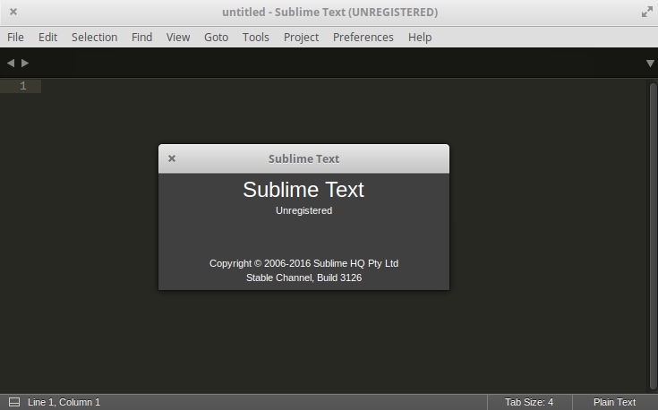


## Sublime Basics
- It has bunch of features & plug-ins to automate work flows
- Open sublime application from the menu


## Sublime Exercise
- Simple automated work flow with syntax from Sublime Text website

```
[Monday, Tuesday, Wednesday, Thursday, Friday]
```

## Installed plug-ins & use case

- [Package control](https://packagecontrol.io/) is to manage all packages in sublime text
    + [Markdown Preview](https://github.com/revolunet/sublimetext-markdown-preview)
    + [Markdown Editing](https://github.com/SublimeText-Markdown/MarkdownEditing)
    + [Git](https://github.com/SublimeGit/SublimeGit)
    + [Git Gutter](https://github.com/jisaacks/GitGutter)
    + [PlainTasks](https://github.com/aziz/PlainTasks)
    + [SublimeCodeIntel](https://github.com/SublimeCodeIntel/SublimeCodeIntel)
    + [SideBarEnhancements](https://github.com/SideBarEnhancements-org/SideBarEnhancements)
    + [BracketHighlighter](https://github.com/facelessuser/BracketHighlighter)
  

## Let's start with Plain Tasks
- Open sublime text application and save file with `.todo` extension
    + For example `puliya.todo`
- Now we can create projects, tasks, priority, etc. 
- This is simple and super powerful project management tool


## Sublime Text Plug-ins (Plain Tasks)
- Click on `File -> Open File` and select `Documents/puliya.todo` file

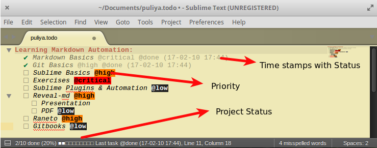


## Sublime Text Plug-ins (Markdown Preview and Markdown Editing)
- These plug-ins will allow us to write `Markdown` in sublime and also to generate HTML documents.
- Click on `File -> New File` and save file with `.md` extension
    + For example `puliya.md`
- Now we can write Markdown text here


## Sublime Text Plug-ins (Markdown Preview and Markdown Editing)
- Click on `File -> Open File` and select `Documents/puliya.md` file

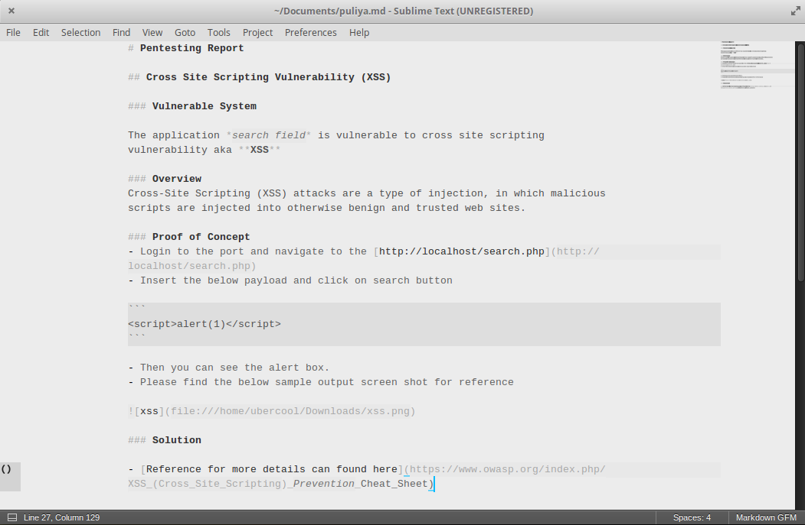

## Sublime Text Plug-ins (Markdown Preview and Markdown Editing)
- Automating the live HTML preview in real-time
- Press `ctrl+b`

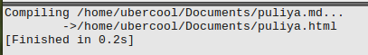


## Sublime Text Plug-ins (Markdown Preview and Markdown Editing)
- Now open that path in your browser

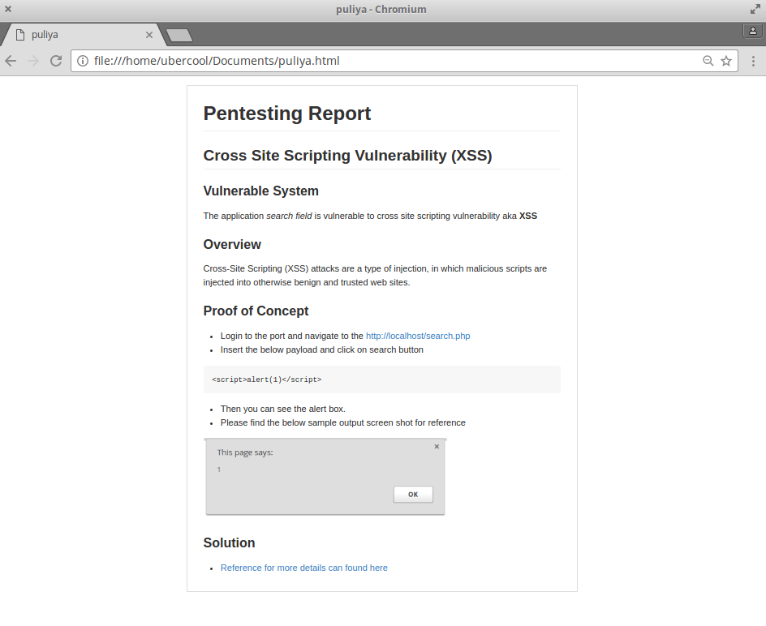


## Sublime Text Plug-ins (Markdown Preview and Markdown Editing)
- Automating the work flow of compilation and preview using sublime short-cuts
- Open `Preference -> Package Settings -> Markdown Editing -> Key Bindings - User` and paste the below code

```
[
    { "keys": ["alt+m"], "command": "markdown_preview", "args": {"target": "browser", "parser":"markdown"} },
]
```

- Now just press `alt + m` on keyboard and it will automatically compile and preview in the favourite browser

## Sublime Text Plug-ins (Git & Git Gutter)
- Get more productive with git using sublime text
- Open the project folder where your git project is available
- `ctrl + shift + p`, then type Git and you’ll see your available Git commands.
- `ADD`, `COMMIT`, AND `PUSH` WITHIN SUBLIME TEXT


## Sublime Text Plug-ins (Git & Git Gutter) [Contd.]
- My workflow when trying to push code to the server inside of Sublime Text looks like:

> `ctrl + shift + p`, then type `Add current file` and `ctrl + shift + p`, type `quick commit`, then type `message` `ctrl + shift + p`, type `push`

- [https://scotch.io/tutorials/using-git-inside-of-sublime-text-to-improve-workflow](https://scotch.io/tutorials/using-git-inside-of-sublime-text-to-improve-workflow)


## Introducing [Reveal JS](http://lab.hakim.se/reveal-js/)
- A framework for easily creating beautiful presentations using HTML

> `reveal.js` comes with a broad range of features including nested slides, Markdown contents, PDF export, speaker notes and a JavaScript API. There's also a fully featured visual editor and platform for sharing reveal.js presentations at slides.com.


## How to automated Markdown to Presentation(reveal.js) using reveal-md
**What is reveal.md?**
> reveal.js on steroids! Get beautiful reveal.js presentations from your Markdown files

- `reveal-md` is a nodejs tool to convert and preview `reveal.js` presentations using markdown


## reveal-md demo
- Open sublime and create new file and paste the below content and save with `.md` extension
    + For examples `presentation.md`

```
# Title

* Point 1
* Point 2

---

## Second slide

> Best quote ever.

Note: speaker notes FTW!
```


## reveal-md demo [Contd.]
- Now open your terminal and type the below command. Make sure the md file path is `presentation.md` (your markdown file) correct.

```
$ reveal-md ~/Documents/presentation.md
```

- Now it will automatically open this in your favourite browser.
- Press `s` to see the speaker view

Note: If time permits, we can do simple exercises


## reveal-md demo [Contd.]
- To print the presentation, run the below command
```
$ reveal-md ~/Documents/presentation.md --print ~/Documents/presentation.pdf
```

- We can also use separators (vertical, horizontal) and different themes as well


## reveal-md demo [Contd.]
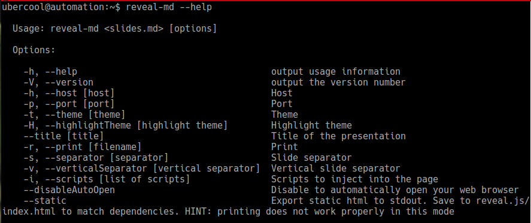

- Check out [https://github.com/webpro/reveal-md](https://github.com/webpro/reveal-md) for more details


## Knowledgebase
- A store of information or data that is available to draw on.

> A knowledge base (KB) is a technology used to store complex structured and unstructured information used by a computer system.


## Why Knowledgebase

> Writing documentation is very important and keeping it updated and available everyone in the organisation is difficult with traditional methods. Knowledgebase allows to have a centralised place to look for all the documentation, how-to guides, playbooks, many more. It will also help us to write (or) generate more content for articles, blog posts, reference material, etc.


## Introducing [Raneto](http://raneto.com/)

> Raneto is a Knowledgebase platform for Node.js that uses static Markdown files to power the knowledgebase.
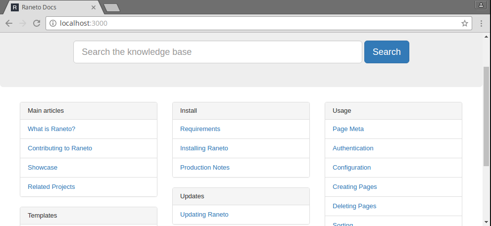


## Raneto [Contd.]
Raneto can be called a "static site generator" of sorts as it doesn't require a database. All of your content is stored in the content folder in Markdown (.md) files and the entire knowledgebase structure and content is generated by Raneto. This is good because it's:

- Simple: You can create and manage an entire knowledge base using your favourite text editor
- Flat: Raneto is a "flat file" CMS, meaning no database woe's, no MySQL queries, nothing
- Fast: Raneto is seriously lightweight and doesn't use a database, making it super fast


## Let's start Raneto server
- Navigate to the `Raneto` directory
```
$ cd /home/ubercool/Raneto
```

- Start the `Raneto` server by running the below command
```
$ npm start
```

- Then navigate to [http://localhot:3000](http://localhot:3000) in your favourite browser


## How to add content to the knowledgebase?
- We have to write our `Markdown` files and keep them under content folder
- For example, run the below command open sublime with `null-puliya.md` under content folder in another terminal window
```
$ subl /home/ubercool/Raneto/example/content/null-puliya.md
```

- Then paste the below `Markdown` text and save the file
````
# Pentesting Report

## Cross Site Scripting Vulnerability (XSS)

### Vulnerable System

The application *search field* is vulnerable to cross site scripting vulnerability aka **XSS**

### Overview
Cross-Site Scripting (XSS) attacks are a type of injection, in which malicious scripts are injected into otherwise benign and trusted web sites.

### Proof of Concept
- Login to the port and navigate to the [http://localhost/search.php](http://localhost/search.php)
- Insert the below payload and click on search button

```
<script>alert(1)</script>
```

- Then you can see the alert box.
- Please find the below sample output screen shot for reference


### Solution

- [Reference for more details can found here](https://www.owasp.org/index.php/XSS_(Cross_Site_Scripting)_Prevention_Cheat_Sheet)
````

- Refresh the page and see the updated knowledgebase


## Alternative Solution to Raneto - Introducing [MkDocs](http://www.mkdocs.org/)
> `MkDocs` is a fast, simple and downright gorgeous static site generator that's geared towards building project documentation. Documentation source files are written in Markdown, and configured with a single YAML configuration file.

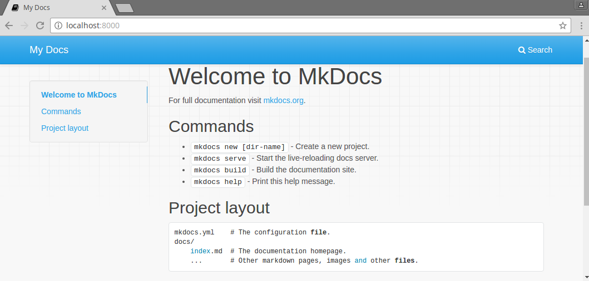

## Let's start MkDocs
- Run the below command to create new `MkDocs` project
```
$ mkdocs new /home/ubercool/Documents/null-puliya-project
$ cd ~/Documents/null-puliya-project
```

- To server the documents run the below command
```
$ mkdocs serve
```

- Navigate to [http://localhost:8000](http://localhost:8000) to see MkDocs web UI


## Adding documents to MkDocs
- Now we have to write our `Markdown` files and keep them under `docs` folder
- For example, run the below command open sublime with `null-puliya.md` under docs folder in another terminal window
```
$ subl /home/ubercool/Documents/null-puliya-project/docs/null-puliya.md
```

- Then paste the below `Markdown` text and save the file
````
# Pentesting Report

## Cross Site Scripting Vulnerability (XSS)

### Vulnerable System

The application *search field* is vulnerable to cross site scripting vulnerability aka **XSS**

### Overview
Cross-Site Scripting (XSS) attacks are a type of injection, in which malicious scripts are injected into otherwise benign and trusted web sites.

### Proof of Concept
- Login to the port and navigate to the [http://localhost/search.php](http://localhost/search.php)
- Insert the below payload and click on search button

```
<script>alert(1)</script>
```

- Then you can see the alert box.
- Please find the below sample output screen shot for reference


### Solution

- [Reference for more details can found here](https://www.owasp.org/index.php/XSS_(Cross_Site_Scripting)_Prevention_Cheat_Sheet)
````

- Now refresh the page and see the updated docs


## Let's go beyond - Introducing [GitBook](https://www.gitbook.com/)
- GitBook helps your team write, collaborate and publish content.
- Modern documentation format and toolchain using Git and Markdown


## Why GitBook
- Write using Markdown or AsciiDoc
- Output as a website or ebook (pdf, epub, mobi)
- Multi-Languages
- Lexicon / Glossary
- Cover
- Variables and Templating
- Content References
- Plugins
- Beautiful default theme


## Let's create basic GitBook
- To initiate gitbook, run the below command
```
$ gitbook init /home/ubercool/nullbook
$ cd /home/ubercool/nullbook
```

- Now serve the gitbook by running below command
```
$ gitbook serve
```

- Now navigate to [http://localhost:4000])(http://localhost:4000)


## How to add content to GitBook
- Now we have to write our `Markdown` file.
- For example, run the below command open sublime with `null-puliya.md` under docs folder in another terminal window
```
$ subl /home/ubercool/nullbook/null-puliya.md
```

- Then paste the below `Markdown` text and save the file
````
# Pentesting Report

## Cross Site Scripting Vulnerability (XSS)

### Vulnerable System

The application *search field* is vulnerable to cross site scripting vulnerability aka **XSS**

### Overview
Cross-Site Scripting (XSS) attacks are a type of injection, in which malicious scripts are injected into otherwise benign and trusted web sites.

### Proof of Concept
- Login to the port and navigate to the [http://localhost/search.php](http://localhost/search.php)
- Insert the below payload and click on search button

```
<script>alert(1)</script>
```

- Then you can see the alert box.
- Please find the below sample output screen shot for reference


### Solution

- [Reference for more details can found here](https://www.owasp.org/index.php/XSS_(Cross_Site_Scripting)_Prevention_Cheat_Sheet)
````


## GitBook [Contd.]
- Then we have to add that to index file called `SUMMARY.md`. Open the `SUMMARY.md` file using below command

```
$ subl /home/ubercool/nullbook/SUMMARY.md
```

- Then add the below content at the end of the file
```
* [Presentation](null-puliya.md)
```

- Now go back the browser and see the updated GitBook page


## How about using Editor - GitBook Editor
- GitBook Editor is available for all platforms
- It's GUI for writing GitBooks
- Open GitBook Editor application from the menu
- It has integration with Git as well


## GitBook Editor
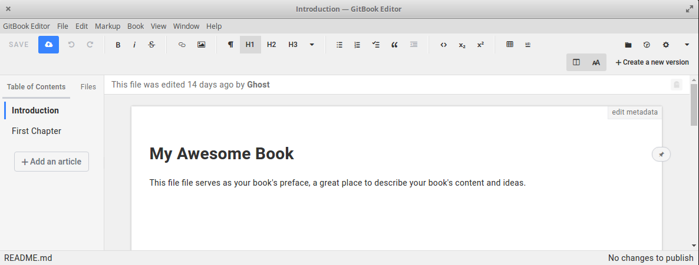


## Markdown Automation Use Cases - Introducing [Pandoc](http://pandoc.org/)
> Pandoc is an universal document converter

- If you need to convert files from one markup format into another, pandoc is your swiss-army knife.


## Pandoc Conversions


## Simple Automated work-flow from `Markdown` to `MS Word Document`
- Convert Markdown file to MS Word Document using pandoc
```
$ pandoc -o <output word file> -f markdown -t docx <input markdown file>
```

- Create a sample markdown file `subl test.md` and save the file
```
# This is heading one
Random content for word document testing

## Second Heading
Pandoc is awesome

### This is final one
- Cool stuff
- Ubercool stuff
```

- Run the below command to convert markdown file to docx (word document)
```
$ pandoc -o test.docx -f markdown -t docx test.md
```

